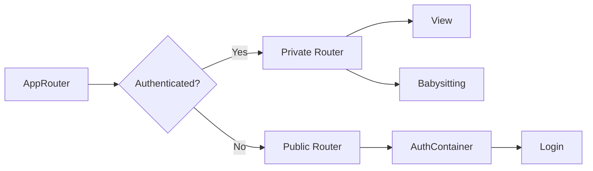
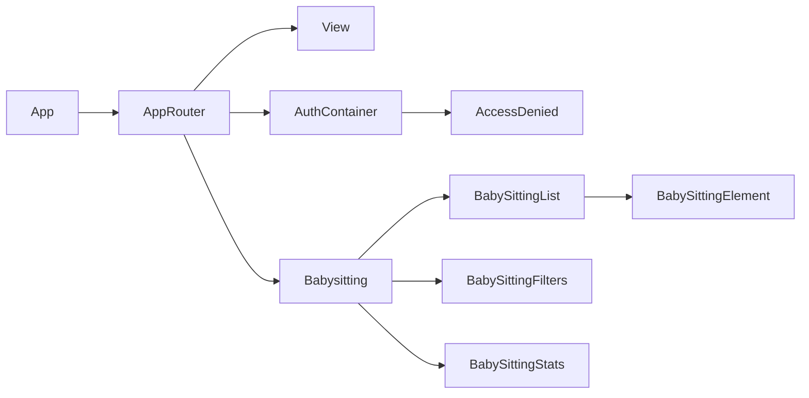

# Design

## Architecture

The Babysitter Timer is a React application that uses Firebase for authentication and data storage. The app is designed to help users track babysitting sessions, calculate durations, and manage payments. It features a modern Material-UI interface with both light and dark theme support.

## Component Structure

The app uses the following key components:

* `AppRouter`: Defines the routing logic for the application
* `View`: Displays the main view of the app
* `Babysitting`: Allows users to add and edit babysitting entries
* `BabySittingList`: Displays a list of babysitting entries
* `BabySittingFilters`: Provides filtering options for babysitting entries
* `BabySittingStats`: Shows statistics about babysitting entries
* `AuthContainer`: Handles user authentication

## Data Flow

The app uses the following data flow:

1. The user interacts with the UI
2. The UI updates the state of the app (using Recoil for state management)
3. The state of the app is synchronized with Firebase
4. Firebase updates the UI

## Router Diagram

## Component Diagram

## UX/UI Design

### Login Screen

The login screen (`AuthContainer` component) follows modern UX/UI principles:

#### Visual Design
- **Clean and Minimalist**: The interface uses a simple, uncluttered design with ample white space
- **Card-Based Layout**: Content is contained within a rounded card with shadow effects, creating depth and focus
- **Responsive Design**: Adapts to different screen sizes with a maximum width constraint
- **Consistent Color Scheme**: Uses a blue accent color for interactive elements, creating visual consistency

#### User Experience Elements
- **Clear Hierarchy**: Large heading ("Bienvenue") establishes the purpose of the screen
- **Contextual Subheading**: Brief explanation text guides users on what to do
- **Input Field Affordances**:
  - Descriptive labels above each field
  - Placeholder text for additional guidance
  - Iconic prefixes (email and key icons) to visually reinforce field purpose
  - Full-width inputs for better visibility and touch targets

#### Interaction Design
- **Dual Action Buttons**:
  - "S'inscrire" (Sign Up) for new users
  - "Se connecter" (Sign In) for returning users
  - Both buttons have the same visual weight, avoiding bias toward either action
- **Button States**: Hover effects change button appearance, providing visual feedback
- **Focus States**: Focus rings improve accessibility for keyboard navigation
- **Feedback Mechanisms**: Alert messages for successful login/registration or error conditions

#### Accessibility Considerations
- **Semantic HTML**: Proper use of headings and labels
- **Focus Management**: Focus states for keyboard navigation
- **Icon + Text Combinations**: Icons are paired with text labels rather than used alone
- **Visual Separation**: Border divider helps segment the form from the action buttons

#### Areas for Potential Improvement
- **Password Recovery**: Adding a "Forgot Password" option would enhance user experience
- **Form Validation**: Client-side validation before submission could prevent unnecessary server calls
- **Remember Me**: Option to stay logged in for convenience on private devices
- **Social Login Options**: Integration with social media authentication for faster onboarding
- **Loading States**: Visual indicators during authentication processes

### Theme System

The application implements a comprehensive theming system with both light and dark modes:

#### Visual Design
- **Dual Theme Support**: Complete light and dark mode implementations
- **Consistent Color Palette**: Coordinated colors across both themes
- **Custom Background Patterns**: Subtle background patterns that change with theme
- **Elevation and Depth**: Shadow effects that adapt to the current theme
- **Component Consistency**: All UI elements maintain visual consistency across themes

#### Theme Components
- **ThemeToggle**: Accessible button for switching between themes
- **ThemeProvider**: Context provider that manages theme state
- **Material-UI Theme**: Extended Material-UI theming with custom overrides

#### User Experience Benefits
- **Reduced Eye Strain**: Dark mode option for low-light environments
- **Personal Preference**: Users can choose their preferred visual style
- **Consistent Experience**: Seamless transition between themes without layout shifts
- **Persistent Preference**: Theme choice is remembered between sessions
- **Visual Hierarchy**: Maintained visual importance across both themes

#### Technical Implementation
- **Context API**: React Context for theme state management
- **localStorage Persistence**: Theme preference saved to browser storage
- **Dynamic Styling**: Responsive styling that adapts to the current theme
- **Transition Effects**: Smooth animations when switching themes
- **Component Overrides**: Custom styling for Material-UI components
